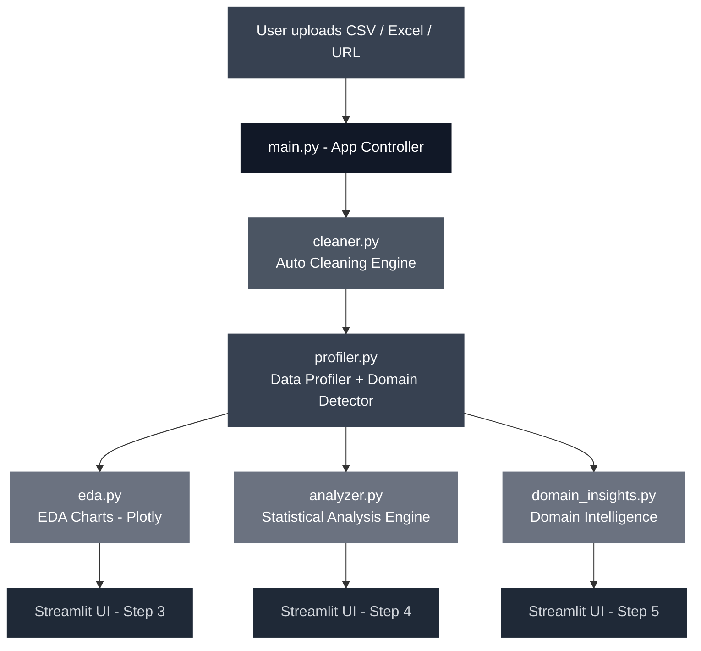
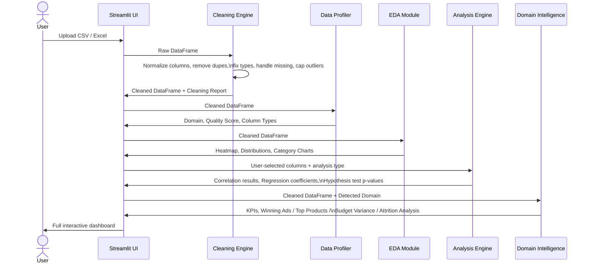
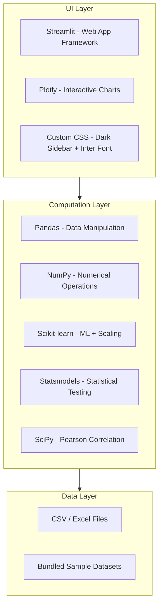

# DataPulse - Universal Data Analytics Dashboard

> Upload any structured dataset. DataPulse cleans it, profiles it, and surfaces insights - automatically.

DataPulse is an interactive data analytics web application that demonstrates end-to-end data engineering capability. It takes raw, messy, real-world data and walks it through a complete analytics pipeline: automated cleaning, intelligent profiling, exploratory analysis, statistical modeling, and domain-specific business insights - all without writing a single line of code.

Built to prove one thing: **I can take your data from dirty to decision-ready.**

---


---

**Live Demo:** [dpulse.streamlit.app](https://dpulse.streamlit.app)
**Repository:** [github.com/salehmdasif/streamlit_datapulse](https://github.com/salehmdasif/streamlit_datapulse)
**Author:** [Abu Salah Mohammad Asif](https://linkedin.com/in/salehmdasif) · Ravelweb Ltd

---

## Table of Contents

- [Problem Statement](#problem-statement)
- [Solution Overview](#solution-overview)
- [Architecture Overview](#architecture-overview)
- [The 5-Step Pipeline](#the-5-step-pipeline)
- [Features](#features)
- [Technology Stack](#technology-stack)
- [Domain Intelligence](#domain-intelligence)
- [Project Structure](#project-structure)
- [Technical Skills Demonstrated](#technical-skills-demonstrated)
- [Project Metrics](#project-metrics)
- [Sample Datasets](#sample-datasets)
- [Setup](#setup)
- [Case Study](#case-study)
- [License](#license)

---

## Problem Statement

Businesses generate enormous amounts of data - ad campaign exports, sales reports, HR spreadsheets, financial summaries. The data is almost never clean. It has missing values, wrong data types, currency symbols where numbers should be, duplicate rows, and outliers that skew everything.

Most people either:
1. Hand it to a data analyst who takes days to produce a static report
2. Try to use Excel and give up halfway through
3. Pay for expensive BI tools that require weeks of setup

**The gap:** There is no simple, intelligent tool that takes a dirty CSV and immediately shows you what's in it, what's wrong with it, and what it means for your business.

---

## Solution Overview

DataPulse is a five-step analytics pipeline wrapped in a clean web interface:

1. **Load** - upload any CSV or Excel file (or try one of 4 sample datasets)
2. **Clean** - auto-detect and fix data quality issues with full transparency
3. **Profile** - classify columns, detect business domain, score data quality
4. **Analyze** - run correlation, group comparison, trend analysis, regression, and hypothesis testing
5. **Insights** - get domain-specific intelligence tailored to Marketing, Sales, Finance, or HR data

The entire pipeline runs in the browser. No setup. No code. No waiting.

---

## Architecture Overview

DataPulse is built as a modular Python application with a clean separation between computation and presentation. Each analytical capability lives in its own module and is completely independent - new domains or analysis types can be added without touching existing code.



> 💡 View this diagram: open `docs/diagrams/architecture.mmd` in [Mermaid Live Editor](https://mermaid.live)

### Component Breakdown

| Module | Responsibility |
|---|---|
| `main.py` | App controller, session state management, full UI rendering |
| `cleaner.py` | Missing value detection, duplicate removal, type inference, outlier detection |
| `profiler.py` | Column classification, data quality scoring, keyword-based domain detection |
| `eda.py` | All Plotly chart functions (heatmap, distributions, bar charts, scatter, trend) |
| `analyzer.py` | Pearson correlation, group aggregation, time-series, linear regression, OLS hypothesis testing |
| `domain_insights.py` | Domain-specific KPI logic for Marketing, Sales, Finance, and HR datasets |

---

## The 5-Step Pipeline



> 💡 View this diagram: open `docs/diagrams/feature-flow.mmd` in [Mermaid Live Editor](https://mermaid.live)

---

## Features

### Step 1 - Intelligent Data Ingestion

**Purpose:** Accept data from any source without friction.

**Capabilities:**
- Upload CSV, XLS, or XLSX files directly
- Load from a direct URL (CSV/Excel)
- Load one of 4 built-in sample datasets (Marketing, Sales, Finance, HR)
- Each sample contains intentional data quality issues to demonstrate the cleaning engine

**Why it matters:** Real data comes from everywhere - ad platform exports, CRM downloads, manual spreadsheets. DataPulse accepts all of them.

---

### Step 2 - Auto Data Cleaning Engine

**Purpose:** Systematically detect and fix every common data quality issue - with full user control and a transparent report.

**What it detects and fixes:**

| Issue | Detection Method | Resolution Options |
|---|---|---|
| Missing values | Per-column null count + percentage | Fill mean / median / mode / drop rows |
| Duplicate rows | Exact match detection | Auto-remove |
| Wrong data types | 80% threshold numeric/datetime inference | Auto-convert (strips currency symbols: $, €, £) |
| Column name noise | Whitespace, case, special characters | Auto-normalize to snake_case |
| All-null columns | 100% empty detection | Auto-drop |
| Outliers | IQR method (Q1 - 1.5×IQR, Q3 + 1.5×IQR) | Keep / Cap / Remove / Flag with new column |

**Cleaning Report:** Every action taken is logged - what was changed, how many rows affected, what values were used for filling. Nothing happens silently.

**Engineering note:** The cleaning engine operates on a deep copy of the original data. The original is never mutated. If the user re-loads data, state resets completely.

---

### Step 3 - Data Profiler & Domain Detection

**Purpose:** Understand the dataset structure before touching it analytically.

**Column Classification:**

| Type | How Detected |
|---|---|
| `numeric` | `is_numeric_dtype()` |
| `categorical` | Object/string + ≤ 20 unique values or < 15% unique ratio |
| `datetime` | 80%+ values parse as datetime |
| `boolean` | ≤ 2 unique values |
| `id_text` | Object/string + > 80% unique ratio (name/ID columns - excluded from analysis) |

**Data Quality Score (0–100):**
- 50% weight: completeness (% non-null cells)
- 30% weight: uniqueness (% unique rows)
- 20% weight: column health (penalise all-null columns)

**Domain Auto-Detection:** Keyword matching against column names identifies the business domain. The detected domain activates tailored insights in Step 5.

| Domain | Trigger Keywords |
|---|---|
| Marketing / Ads | `roas`, `ctr`, `cpc`, `impressions`, `clicks`, `spend`, `campaign`, `hook_rate` |
| Sales | `revenue`, `order`, `product`, `quantity`, `price`, `discount` |
| Finance | `profit`, `expense`, `budget`, `income`, `actual`, `cost` |
| HR / People | `employee`, `salary`, `attrition`, `department`, `tenure`, `gender` |
| E-commerce | `sku`, `cart`, `checkout`, `conversion`, `aov` |

---

### Step 4 - EDA (Exploratory Data Analysis)

**Purpose:** Surface the structure and relationships in the data visually.

**Summary Statistics Tab:** Full `describe()` output for all numeric columns - count, mean, std, min, quartiles, max.

**Correlation Heatmap:** Full Pearson correlation matrix rendered as an annotated Plotly heatmap (blue-to-red scale, values overlaid). Top 5 strongest correlations listed with plain-English strength labels (Very Strong / Strong / Moderate / Weak).

**Distribution Explorer:** Per-column histogram (25 bins) and box plot rendered side by side. Skewness and kurtosis displayed as caption.

**Category Explorer:** Horizontal bar chart of value counts for any categorical column. Shows top value, unique count, and top value percentage.

---

### Step 5 - Statistical Analysis Engine

**Purpose:** Run rigorous statistical methods with one click, explained in plain English.

**Correlation Analysis:**
- Pearson r, R², p-value, sample size
- Plain-English interpretation: "Strong positive correlation... explains X% of variance"
- Significance statement (p < 0.05)
- Scatter plot with OLS trend line

**Group Comparison:**
- Aggregate any numeric column by any categorical column
- Aggregation: mean / sum / median / count
- Horizontal bar chart + values table
- Instantly answers: "Which campaign type has the highest avg ROAS?"

**Trend Analysis:** *(activates when datetime column detected)*
- Daily/periodic line chart with configurable rolling average (3/7/14/30 periods)
- Automatically aggregates multiple records per date

**Linear Regression:**
- StandardScaler applied before fitting (coefficients are comparable)
- Output: R², Adjusted R², F-statistic p-value, AIC, sample size
- Feature importance bar chart (sorted by |coefficient|)

**Hypothesis Testing:**
- OLS via `statsmodels` for full statistical output
- Per-feature cards: coefficient, std error, t-statistic, p-value, 95% confidence interval
- Color-coded: green = statistically significant (p < 0.05), gray = not significant

---

### Step 6 - Domain Intelligence

**Purpose:** Go beyond generic analysis to domain-specific business insights that directly answer relevant questions.

See [Domain Intelligence](#domain-intelligence) section below.

---

## Technology Stack



> 💡 View: open `docs/diagrams/tech-stack.mmd` in [Mermaid Live Editor](https://mermaid.live)

| Layer | Technology | Why Chosen |
|---|---|---|
| Web Framework | Streamlit 1.32+ | Rapid interactive app development in pure Python; no frontend code required |
| Charts | Plotly 5.20+ | Interactive, publication-quality charts with hover tooltips; better than Matplotlib for web |
| Data Manipulation | Pandas 2.0+ | Industry standard for tabular data; rich dtype inference and aggregation API |
| Statistical Testing | Statsmodels 0.14 | Full OLS output with p-values, confidence intervals, and F-statistics |
| Regression | Scikit-learn 1.4+ | StandardScaler for feature normalisation before regression |
| Correlation | SciPy | Pearson r with two-tailed p-value in a single call |
| Numerical | NumPy 1.26+ | Array operations and IQR outlier bounds |

---

## Domain Intelligence

Domain Intelligence is Step 5 of the pipeline. Once a domain is detected, DataPulse activates a tailored set of KPIs, charts, and insights specific to that business context.

### Marketing / Ads Mode

Activated when columns like `roas`, `ctr`, `cpc`, `impressions` are detected.

**KPI Summary Cards:** Total Spend, Avg ROAS, Avg CTR, Avg CPC, Avg CPR, Avg Result Rate, Total Impressions, Total Clicks, Total Results.

**Winning Ad Selector:** The centrepiece feature. Filter ads that meet ALL performance criteria simultaneously. Nine sliders give full control over every threshold:

| Threshold | Default | Meaning |
|---|---|---|
| Min Spend | $100 | Only consider ads with meaningful budget |
| Min ROAS | 2.0x | Return must exceed cost by 2× |
| Min Result Rate | 20% | At least 1 in 5 viewers must convert |
| Min Scroll Stop | 25% | Ad must stop the scroll |
| Min Hook Rate | 30% | First 3 seconds must retain viewers |
| Min Hold Rate | 10% | Viewer must watch beyond hook |
| Max CPR | $20 | Cost per result must be under control |
| Min CTR | 2% | Minimum click-through rate |
| Max CPC | $1.50 | Cost per click ceiling |

**Top 5 vs Bottom 5:** Compare best and worst performing ads side-by-side for any metric.

### Sales Mode

Activated when columns like `revenue`, `order`, `product`, `quantity` are detected.

- Total Revenue, Avg Order Value, Total Units Sold, Avg Discount %
- Top 10 Products by Revenue (horizontal bar chart)
- Revenue by Category / Region (table)

### Finance Mode

Activated when columns like `profit`, `expense`, `budget`, `income` are detected.

- Total Income, Total Expense, Net Profit, Profit Margin %, Budget Variance
- Budget vs Actual comparison table with variance % per cost centre

### HR / People Mode

Activated when columns like `employee`, `salary`, `attrition`, `department` are detected.

- Headcount, Attrition Rate %, Attrition Count, Avg Salary, Avg Tenure
- Attrition by Department table
- Salary distribution by Department (avg, median, min, max)
- Auto-normalises mixed attrition encoding: "Yes"/"No"/"1"/"0"/"True"/"False" → unified 0/1

---

## Project Structure

```
streamlit_datapulse/
│
├── main.py                      ← App entry point - full UI + session state
├── requirements.txt             ← Python dependencies
├── .streamlit/
│   └── config.toml              ← Streamlit theme configuration
│
├── modules/
│   ├── __init__.py
│   ├── cleaner.py               ← Auto Data Cleaning Engine
│   ├── profiler.py              ← Data Profiler + Domain Detection
│   ├── eda.py                   ← All Plotly chart functions
│   ├── analyzer.py              ← Statistical Analysis (correlation, regression, OLS)
│   └── domain_insights.py       ← Domain Intelligence (Marketing, Sales, Finance, HR)
│
├── data/
│   └── samples/
│       ├── sample_meta_ads.csv  ← Marketing data with intentional issues
│       ├── sample_sales.csv     ← E-commerce order data
│       ├── sample_finance.csv   ← Monthly budget/actual report
│       └── sample_hr.csv        ← Employee records with mixed encoding
│
├── docs/
│   ├── diagrams/
│   │   ├── architecture.mmd     ← System architecture (Mermaid source)
│   │   ├── feature-flow.mmd     ← User journey sequence diagram
│   │   └── tech-stack.mmd       ← Technology stack diagram
│   └── screenshots/             ← Add screenshots here for portfolio
│
├── PLAN.md                      ← Original 5-phase build plan
├── CASE_STUDY.md                ← Client-facing project story
├── ARCHITECTURE.md              ← Technical architecture deep-dive
└── .gitignore
```

---

## Technical Skills Demonstrated

**Data Engineering:**
- Automated ETL pipeline - raw file → cleaned dataset
- Multi-strategy missing value imputation (mean, median, mode, drop)
- IQR-based outlier detection with 3 resolution strategies
- Automatic currency symbol stripping and type inference
- Data quality scoring across completeness, uniqueness, and structural health

**Statistical Analysis:**
- Pearson correlation with significance testing
- Standardised linear regression (StandardScaler + scikit-learn)
- OLS regression with full hypothesis testing output (statsmodels)
- Time-series aggregation with configurable rolling averages
- Group aggregation with mean/sum/median/count

**Software Architecture:**
- Modular design - 5 independent computation modules + 1 controller
- Session state management for multi-step stateful UI in Streamlit
- Keyword-based domain detection heuristic across 5 business domains
- Flexible column mapping using keyword matching (handles column name variation)

**Python Engineering:**
- Deep copy pattern for safe data mutation
- Dataclass-based reporting (`CleaningReport`)
- Type-annotated function signatures throughout
- Warning suppression for user-facing inference operations
- Pure computation modules with zero Streamlit imports (testable independently)

**UI/UX Design:**
- Custom dark sidebar (gray-900) with branded step tracker
- Injected Inter font with zero border-radius design language
- Custom HTML/CSS components replacing default Streamlit widgets
- Responsive column layouts with gap control
- Color-coded semantic feedback (green/amber/red for significance and quality)

---

## Project Metrics

| Metric | Value |
|---|---|
| Total Python modules | 6 |
| Lines of code (approx) | ~2,000 |
| Analysis methods | 5 (correlation, group, trend, regression, hypothesis testing) |
| Domain intelligence classes | 4 (Marketing, Sales, Finance, HR) |
| Data quality checks | 6 types |
| Bundled sample datasets | 4 (with intentional dirty data) |
| Supported file formats | CSV, XLS, XLSX, URL |
| Plotly chart types | 7 (heatmap, histogram, box, bar, scatter, line, feature importance) |
| Build phases completed | 5 / 5 |
| Estimated complexity | High |

---

## Sample Datasets

All 4 sample datasets are bundled and ready to use - no external data needed. Each has intentional data quality issues to demonstrate the cleaning engine.

| Dataset | Domain | Rows | Intentional Issues |
|---|---|---|---|
| `sample_meta_ads.csv` | Marketing / Ads | 30 | Currency strings (`$250.50`), missing ROAS/CPC, one outlier spend value |
| `sample_sales.csv` | Sales | 30 | Missing revenue, `N/A` unit prices, missing customer names |
| `sample_finance.csv` | Finance | 30 | Missing actuals, `N/A` expenses, outlier profit, column names with spaces |
| `sample_hr.csv` | HR / People | 35 | Mixed attrition encoding (Yes/No/1/0), missing salary, duplicate row |

---

## Setup

### Requirements

- Python 3.11+
- pip

### Install

```bash
git clone https://github.com/salehmdasif/streamlit_datapulse.git
cd streamlit_datapulse
pip install -r requirements.txt
```

### Run

```bash
streamlit run main.py
```

The app opens at `http://localhost:8501`.

No environment variables, no database, no API keys required.

---

## Case Study

> See [CASE_STUDY.md](CASE_STUDY.md) for the full client-facing project story - the problem, the approach, the architecture decisions, and the outcome.

---

## License

Code is fully functional and open for review.

© 2026 Abu Salah Mohammad Asif - Ravelweb Ltd. All rights reserved.

---

*Built with Python · Streamlit · Plotly · Pandas · Scikit-learn · Statsmodels*
